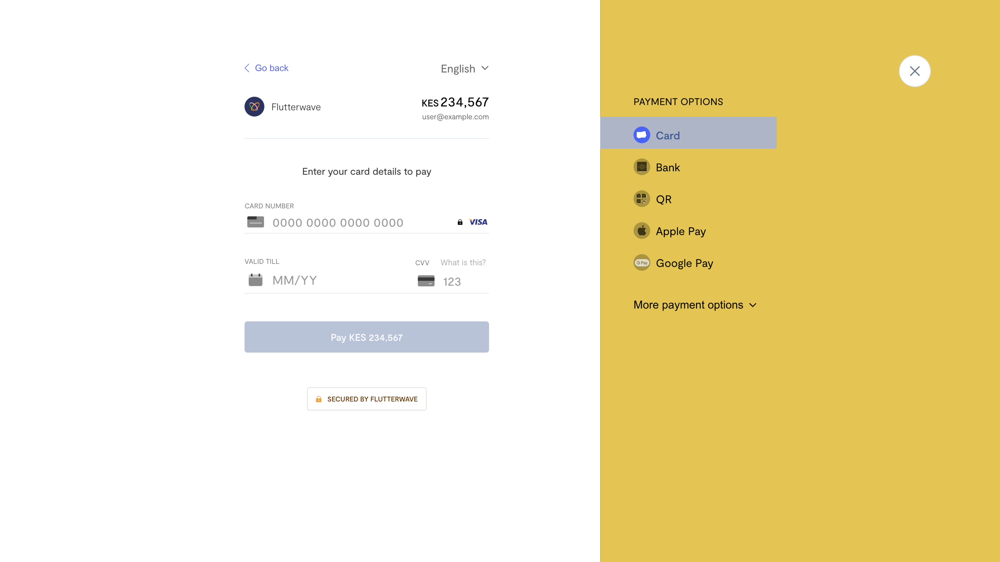
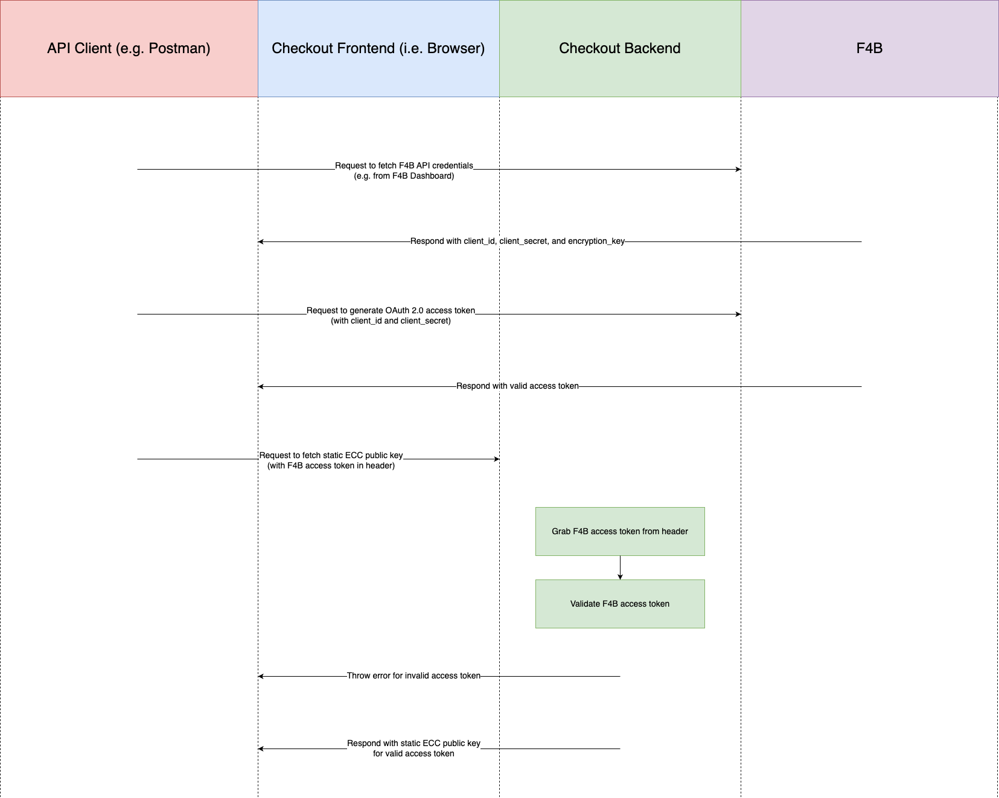
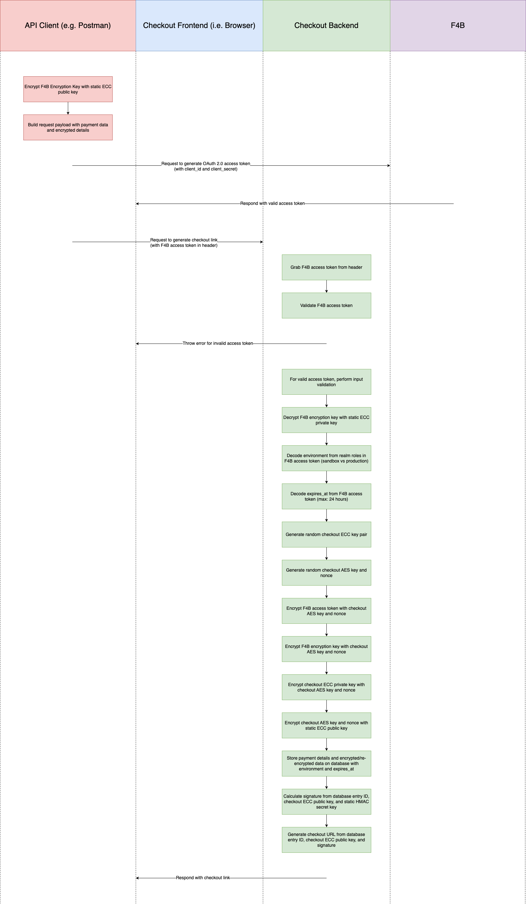
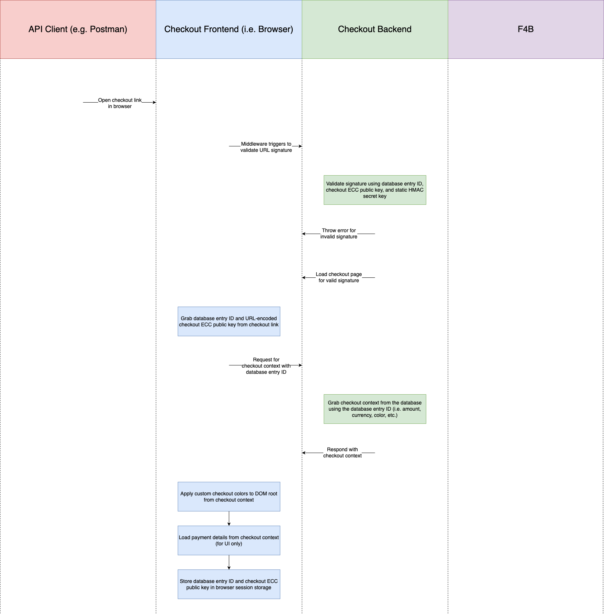
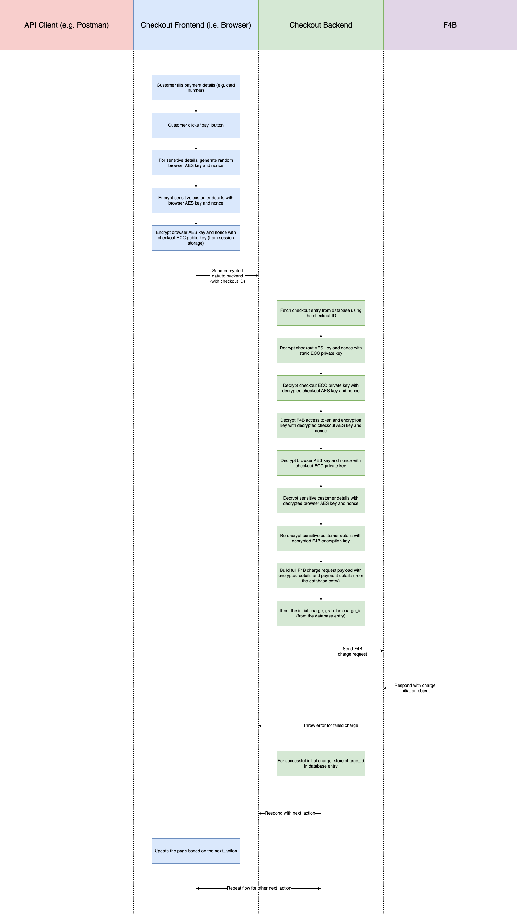
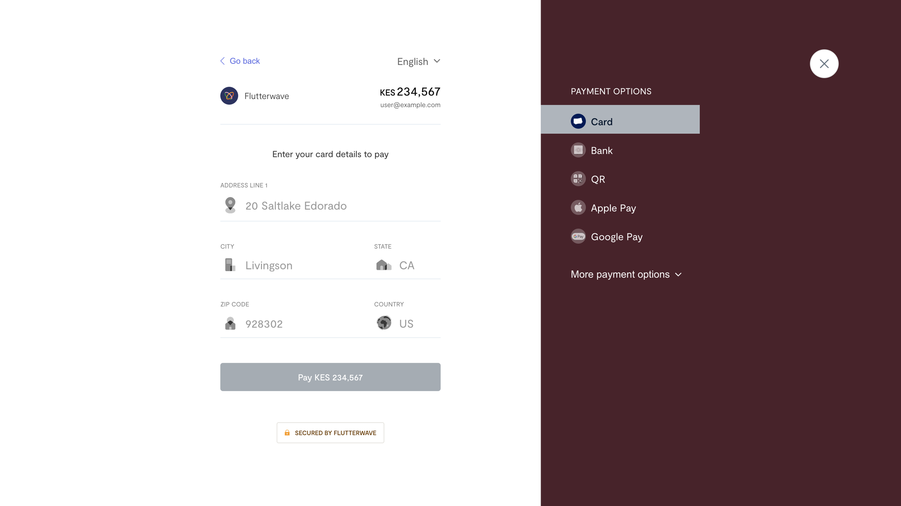
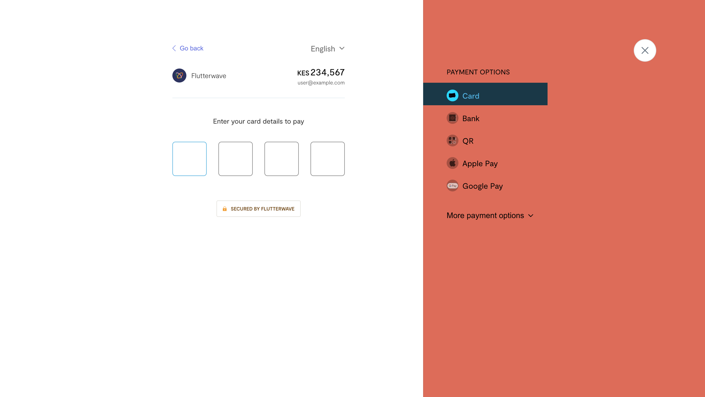
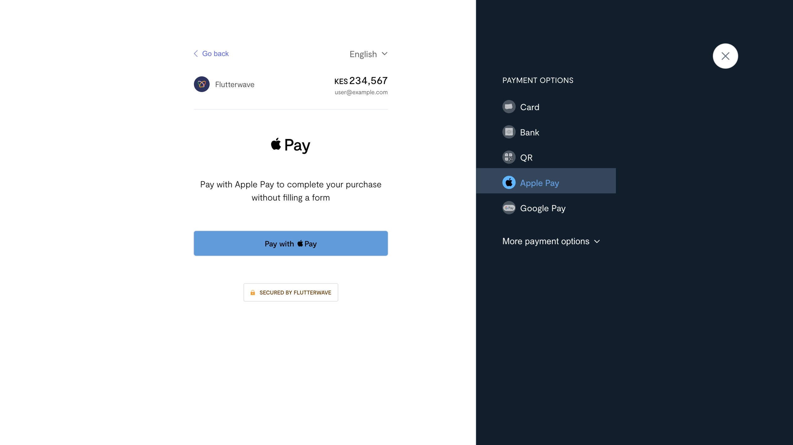

<div align="center">
  
</div>

# Checkout v4 Guide

This is a guide to utilizing a custom Flutterwave v4 checkout that I built to enhance the payment experience. The application was my attempt at answering the question of what a fully customizable checkout might look like, and utilizes [Flutterwave's v4 developer APIs](https://developer.flutterwave.com/v4/docs/introduction-1) to make "dummy payments".

This guide aims to explain the available features of the custom checkout, and the steps that can be taken to expeience the functionality first-hand.

_**Note**: While the code remains private (for now), the project was developed by me. I am happy to discuss the features and any considerations, as well as go over the code and implementation with interested individuals._


## Table of Contents

- [Introduction](#introduction)
- [Key Features](#key-features)
- [Application Flow Diagrams](#application-flow-diagrams)
- [Implementation](#implementation)
- [Testing](#testing)
- [Screenshots](#screenshots)
- [Appendix](#appendix)


## Introduction

The Checkout v4 service enables merchants to securely collect payments by leveraging the v4 charge APIs. Built using Next.js, the service integrates both client and server components and exposes API routes to facilitate the payment flow. A hybrid encryption strategy (AES and ECC) ensures the safeguarding of sensitive user credentials. Additionally, merchants can specify custom colors, allowing the checkout page to align with their brand identity seamlessly.


## Key Features

* **Security Measures**
  * **Hybrid Encryption**: Utilizes AES for data encryption, and ECC for secure key exchange.
  * **Dynamic Keys**: Static ECC key pairs and an HMAC secret key are generated at application startup, ensuring that no sensitive data is hard-coded.
  * **Short-lived Tokens**: OAuth 2.0 access tokens authenticate API requests and authorize charge requests on checkout. They are valid for 10 minutes to reduce the risk of misuse.
  * **Expiring Database Entries**: MongoDB entries expire based on the OAuth 2.0 access token validity (currently 10 minutes), but with a maximum limit of 24 hours.
  * **Signature Validation Middleware**: Ensures that the URL link signature is validated before loading the checkout page.
  * **Browser Session Storage**: Sensitive data (e.g. MongoDB entry ID and ECC public key) is confined to the specific tab, and cleared automatically when the tab is closed, reducing cross-tab exposure.
  * **Server-Side Charge Data**: Data for initiating charge requests on the server is retrieved using the MongoDB entry ID, reducing the risk of frontend manipulation affecting the charge details.
* **UI Building Blocks**
  * **Component Library**: The service leverages a custom UI library which contains components specifically designed for the checkout page.
* **Customizations**
  * **Unlimited Colors**: Users are able to specify their own custom colors which allows the checkout page to better reflect their brand.


## Application Flow Diagrams

### High Level

<div align="center">
  
</div>

### 1. Initial Setup

<div align="center">
  
</div>

### 2. Checkout Link Generation

<div align="center">
  
</div>

### 3. Checkout Page Initialization

<div align="center">
  
</div>

### 4. Payment Processing

<div align="center">
  
</div>


## Implementation

Follow these four steps to interact with the service endpoints:

### 1. Generate an OAuth 2.0 Access Token (Public endpoint)
This allows you to fetch an access token to authorize subsequent API requests. If you already have [developer credentials](https://developer.flutterwave.com/v4/docs/authentication), you can generate your own access tokens. This is just to allow quick flow demonstration, and in production environments, this endpoint would not exist.
```
curl --location 'https://flw-checkout.vercel.app/api/v1/access-token'
```

Sample Response (JSON):
```
{
    "status": "success",
    "message": "Access token fetched successfully",
    "data": {
        "access_token": "eyJhbGciOiJSUzI1NiIsInR5cCIgOiAiSldUIiwia2lkIiA6ICJQdDBYZmJLeHQ2R1c0aF9NNVhLRDJ2Tm9rbVlxTDRwdl82V2pidzVJb3pNIn0.eyJleHAiOjE3NTM3MjUyMjEsImlhdCI6MTc1MzcyNDYyMSwianRpIjoiZjg4Zjc4ZjYtN2Y2Mi00NWYwLWFiODEtYzMxOWM2NGNhMzYwIiwiaXNzIjoiaHR0cHM6Ly9rZXljbG9hay5kZXYtZmx1dHRlcndhdmUuY29tL3JlYWxtcy9mbHV0dGVyd2F2ZSIsImF1ZCI6ImFjY291bnQiLCJzdWIiOiJlOTUxNzE2MS1hYTlkLTRmOGEtODBiMC0xMWYxNTgzNWZjMjYiLCJ0eXAiOiJCZWFyZXIiLCJhenAiOiJlZGQ2NDg3MC0wMDA4LTQ4NTctODFkMy00MDE1YTMwOTY5OWUiLCJhY3IiOiIxIiwicmVhbG1fYWNjZXNzIjp7InJvbGVzIjpbInNhbmRib3hfdHJhbnNmZXJzX3JlYWQiLCJzYW5kYm94X2NoYXJnZXNfd3JpdGUiLCJzYW5kYm94X3BheW1lbnRfbWV0aG9kc19yZWFkIiwib2ZmbGluZV9hY2Nlc3MiLCJzYW5kYm94X2JhbGFuY2VzX3JlYWQiLCJkZWZhdWx0LXJvbGVzLWZsdXR0ZXJ3YXZlIiwidW1hX2F1dGhvcml6YXRpb24iLCJzYW5kYm94X3RyYW5zZmVyc193cml0ZSIsInNhbmRib3hfY2hhcmdlc19yZWFkIiwic2FuZGJveF9wYXltZW50X21ldGhvZHNfd3JpdGUiLCJzYW5kYm94X2N1c3RvbWVyc19yZWFkIiwic2FuZGJveF9jdXN0b21lcnNfd3JpdGUiXX0sInJlc291cmNlX2FjY2VzcyI6eyJhY2NvdW50Ijp7InJvbGVzIjpbIm1hbmFnZS1hY2NvdW50IiwibWFuYWdlLWFjY291bnQtbGlua3MiLCJ2aWV3LXByb2ZpbGUiXX19LCJzY29wZSI6InByb2ZpbGUgZW1haWwiLCJjbGllbnRIb3N0IjoiMTcyLjE3LjQuMjE5IiwiZW1haWxfdmVyaWZpZWQiOmZhbHNlLCJwYXJ0eUlkIjoiOTNmZDljNjUtZGU3OS00MmRjLThmNDAtOTQ3YmQyYmJhZWU4IiwiY2xpZW50QWRkcmVzcyI6IjE3Mi4xNy40LjIxOSIsImNsaWVudF9pZCI6ImVkZDY0ODcwLTAwMDgtNDg1Ny04MWQzLTQwMTVhMzA5Njk5ZSJ9.EAis0rsiFUZ9IQibzLJpQ1cR51jHiewkcYpWpRqB41umI-5dPiviA09HR6OC0Ibq_PQ2bqfalhzo8UnIg9Ha8Snb_YgRYcwMrduyCMlVVkDaTP2yHpfF52Oh5o6qS4d8vyeBBsnungHleBRyzzZtB3TJcuSh_9TpmFo1AdIpxOvSipHccy8Dql1SnT_tNv5HA4NriQ8hWDhvs4tFmxrODRQcgXkCIQtRF1x5yaKYq3IZHpdeZQ3cnkEbZDpqejMZ7GtSS-0lLq0saWjsJ1GggBjrLK2Qzm1TNW1qLR-_sF39wbfgmGD1TKE_mESyCnIEI7pOvy_1yT1529L7yfu_YQ",
        "expires_in": 600,
        "refresh_expires_in": 0,
        "token_type": "Bearer",
        "not-before-policy": 0,
        "scope": "profile email",
        "partyId": "93fd9c65-de79-42dc-8f40-947bd2bbaee8"
    }
}
```

### 2. Fetch Server’s Static Public Key
This allows you to fetch the public key which would be used to encrypt your card encryption key. The keypair is autogenerated on startup, so even I don't know what it would be after every deployment. This is just to allow quick flow demonstration, and in production environments, you would have to encrypt your developer encryption key on your device using Elliptic Curve Cryptography (ECC) before proceeding.
```
curl --location 'https://flw-checkout.vercel.app/api/v1/static-public-key' \
--header 'Authorization: Bearer {{ACCESS_TOKEN}}'
```

Sample Response (JSON):
```
{
    "status": "success",
    "message": "Public key fetched successfully",
    "data": {
        "public_key": "MFkwEwYHKoZIzj0CAQYIKoZIzj0DAQcDQgAEqNbZtmD5/b0oU/gTiNAj2adO+ReYR1pgUr/L04LBGxvZIWvwQP1S84Z1qw4eErtNPU7y2XYUVaKu8aGRJD/4nA=="
    }
}
```

### 3. Retrieve Pre-encrypted Encryption Key
This returns an encryption key that has already been encrypted with the server's static public key (normally you would manually encrypt your own encryption key with the public server's public key). This is just to allow quick demonstration, and in production environments, this endpoint would not exist.
```
curl --location 'https://flw-checkout.vercel.app/api/v1/encrypted-encryption-key' \
--header 'Authorization: Bearer {{ACCESS_TOKEN}}'
```

Response (JSON):
```
{
    "status": "success",
    "message": "Encrypted encryption key fetched successfully",
    "data": {
        "encrypted_encryption_key": "eyJlcGhlbWVyYWxQdWJsaWNLZXkiOls0OCw4OSw0OCwxOSw2LDcsNDIsMTM0LDcyLDIwNiw2MSwyLDEsNiw4LDQyLDEzNCw3MiwyMDYsNjEsMywxLDcsMyw2NiwwLDQsMTM0LDc4LDMwLDE2MCwyMiw0MSwyMzMsMTAzLDI2LDEwLDI0OSwxNDQsMTU3LDIwLDIzLDIzNywyNDEsNjAsMTE4LDUsMjI3LDE0LDE0NiwwLDg2LDkwLDE5NSw5NCw3NCw4NCwxNDMsNjQsMjUsMTk0LDExMiwyMDcsMTEsMjE3LDE5NCwyMzQsNzksMTM5LDE2NiwxNCwxMDEsMTMsMTk4LDU3LDQ0LDIwMCwxMDYsMjAzLDE0Niw0NCwxODAsMTIyLDI0MSwyMDIsMTEyLDIxNiwxMDYsMjU1LDEzMywxNjddLCJpdiI6WzQ1LDIyNywyMzQsOTIsMjMwLDEsMjA5LDE3OCwxMDgsNzEsMTc4LDI0Ml0sImVuY3J5cHRlZEtleSI6Wzg5LDEyMSw0MCwxODMsMTc1LDExNywyMjYsMTk3LDEwMywyMTcsMTEwLDEzNCwyMjksMTQ3LDMzLDE1NCwyMzgsMTU2LDI0LDgxLDE3MSwxMDcsMjQsMjE0LDE2MSwxMiwyMDksODcsMTMsMTMxLDk2LDg2LDYsNDEsMjEwLDEyNCw2NCwxOTEsMzIsMTYzLDE3OCwyMTYsNTEsMTM4LDgyLDkxLDkwLDI1XX0="
    }
}
```

### 4. Generate a checkout link
This generates a secure checkout link which can be used on a browser to complete the payment flow on a customizable payment modal.
```
curl --location 'https://flw-checkout.vercel.app/api/v1/checkout-link' \
--header 'Content-Type: application/json' \
--header 'Authorization: Bearer {{ACCESS_TOKEN}}' \
--data-raw '{
   "credentials": {
       "encrypted_encryption_key": "{{ENCRYPTED_ENCRYPTION_KEY}}"
   },
   "reference": "{{UNIQUE_REFERENCE_STRING}}",
   "amount": 1234.56,
   "currency": "USD",
   "payment_options": "card, banktransfer",
   "redirect_url": "https://www.example.com",
   "customer": {
       "email": "user@example.com"
   },
   "customizations": {
       "title": "Custom title",
       "logo": "https://turtletoy.net/thumbnail/439aa8a191.jpg", // any publicly accessible image
       "description": "Custom description",
       "colors": {
           "primary": "#DD6C59",
           "secondary": "hsl(190, 100%, 50%)",
           "accent": "blue"
       }
   }
}'
```

Response (JSON):
```
{
   "status": "success",
   "message": "Checkout link generated successfully",
   "data": {
       "link": "https://checkout.flutterwave.com/6764a126a7de58bb1d72099e?checkoutKey=MFkwEwYHKoZIzj0CAQYIKoZIzj0DAQcDQgAE1vVUAMhp8reePe3fDaJbqTKp81WOlxhSgo9dylPNjIZF0hDc1RWzdn5ZEa0bk%2BRM1%2FhUtJMfZl6kFj67UEzd8A%3D%3D&signature=4ec5a6618f04e8a0299d514c903f4fac0bd278507fb6d4ca3b299cdc7ec4e946"
   }
}
```


## Testing

### Card

To test card payments, simply use any random numbers and an expiry date in the future. Here is an example, but any valid numbers should suffice:
* Card Number: `4111111111111111`
* Expiry Date: `12`/`34`
* CVV: `123`

For the card PIN and one-time-password (OTP), simply input valid numbers. Here is an example, but any valid number should suffice:
* PIN: `1234`
* OTP: `12345`


## Screenshots

<div align="center">
  
</div>

<div align="center">
  
</div>

<div align="center">
  
</div>

<div align="center">
  
</div>


## Appendix

* [NIST SP 800-56A - Recommendation for Pair-Wise Key Establishment Schemes Using Discrete Logarithm Cryptography](https://nvlpubs.nist.gov/nistpubs/SpecialPublications/NIST.SP.800-56Ar3.pdf)
* [NIST FIPS 186-4 - Digital Signature Algorithm (DSA) and Elliptic Curve Digital Signature Algorithm (ECDSA)](https://nvlpubs.nist.gov/nistpubs/SpecialPublications/NIST.SP.800-56Ar3.pdf)
* [Web Crypto API Specification](https://nvlpubs.nist.gov/nistpubs/SpecialPublications/NIST.SP.800-56Ar3.pdf)
* [Mozilla: Web Crypto API](https://nvlpubs.nist.gov/nistpubs/SpecialPublications/NIST.SP.800-56Ar3.pdf)
* [Mozilla: Crypto](https://nvlpubs.nist.gov/nistpubs/SpecialPublications/NIST.SP.800-56Ar3.pdf)
